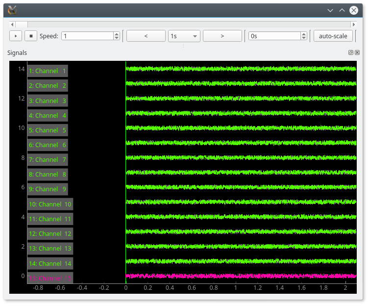
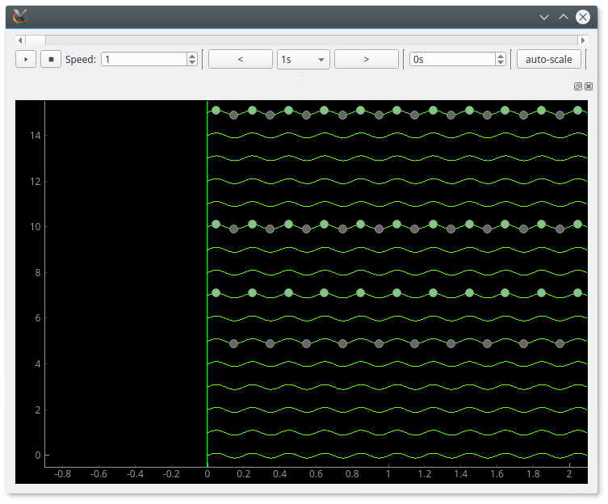
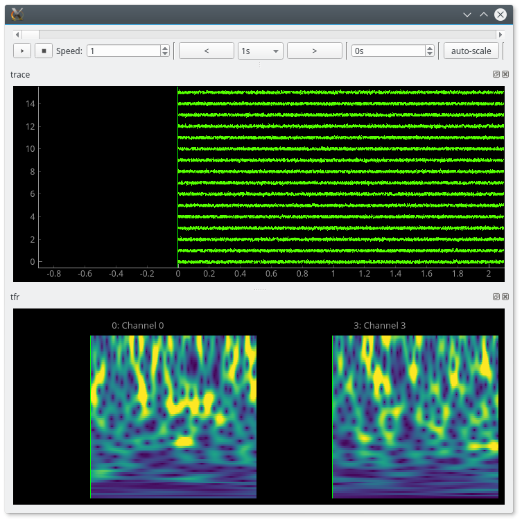
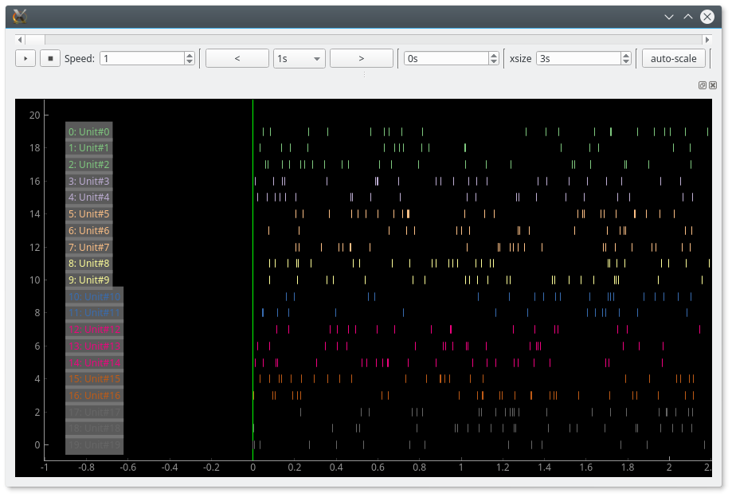
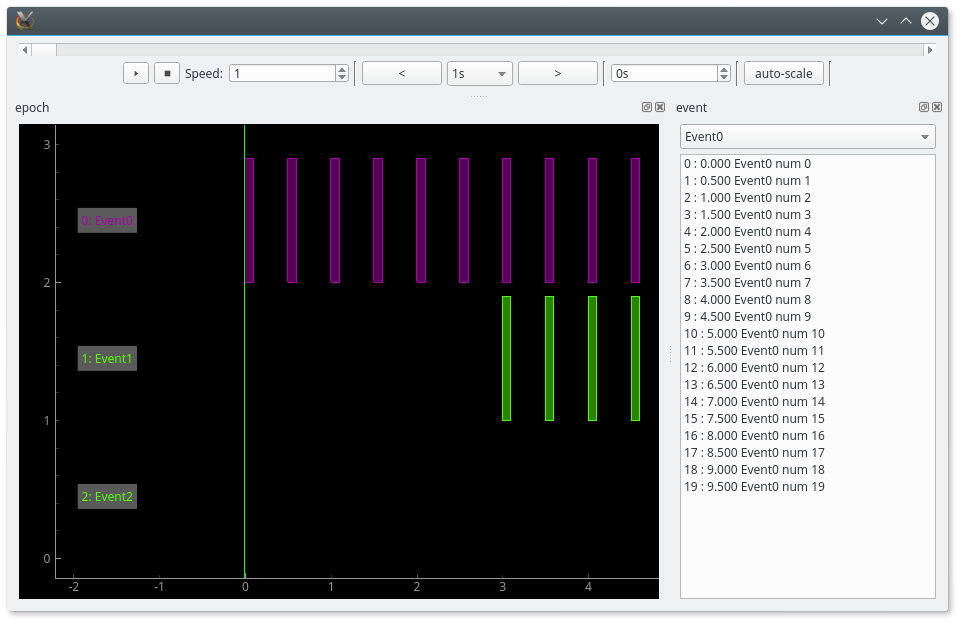
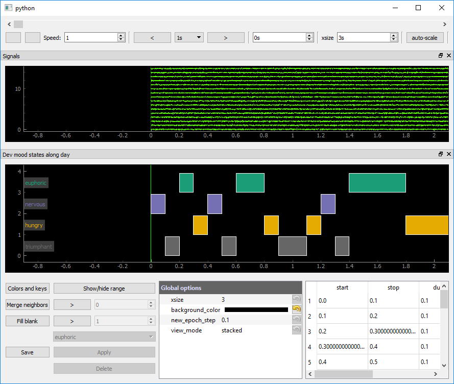
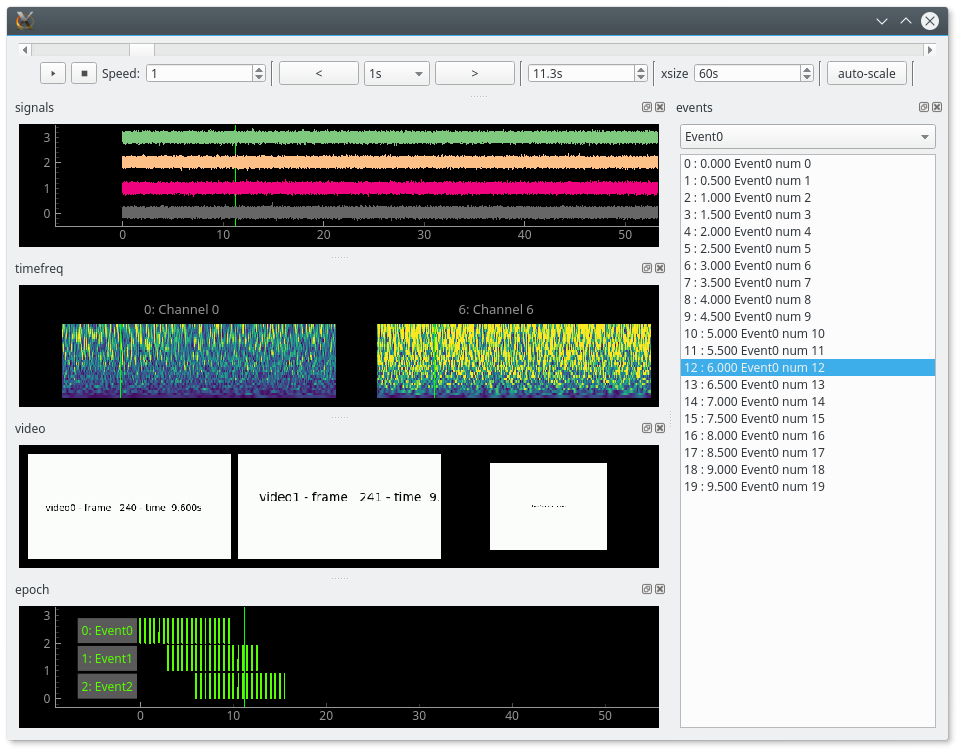
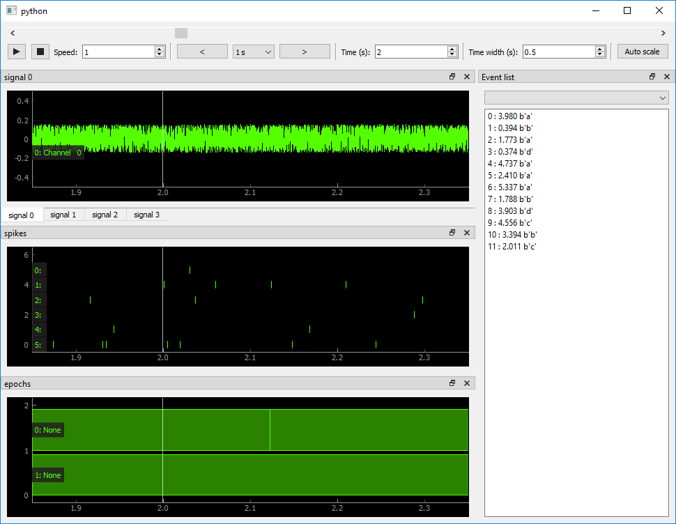

.. _examples:

Examples
========

Simple signal viewer
--------------------

:download:`trace_viewer.py <../examples/trace_viewer.py>`

.. literalinclude:: ../examples/trace_viewer.py

Signal viewer with data source
------------------------------

:download:`trace_viewer_datasource.py <../examples/trace_viewer_datasource.py>`

.. literalinclude:: ../examples/trace_viewer_datasource.py

Signal viewer with markers
--------------------------

:download:`trace_viewer_with_marker.py <../examples/trace_viewer_with_marker.py>`

.. literalinclude:: ../examples/trace_viewer_with_marker.py

Time-frequency viewer
---------------------

:download:`timefreq_viewer.py <../examples/timefreq_viewer.py>`

.. literalinclude:: ../examples/timefreq_viewer.py

Spike train viewer
------------------

:download:`spikes_viewer.py <../examples/spikes_viewer.py>`

.. literalinclude:: ../examples/spikes_viewer.py

Epoch viewer
------------

:download:`event_epoch_viewer.py <../examples/event_epoch_viewer.py>`

.. literalinclude:: ../examples/event_epoch_viewer.py

Epoch encoder
-------------

:download:`epoch_encoder.py <../examples/epoch_encoder.py>`

.. literalinclude:: ../examples/epoch_encoder.py

Mixed viewer
------------

:download:`mixed_viewer.py <../examples/mixed_viewer.py>`

.. literalinclude:: ../examples/mixed_viewer.py

Viewers from Neo objects
------------------------

:download:`viewers_with_neo_objects.py <../examples/viewers_with_neo_objects.py>`

.. literalinclude:: ../examples/viewers_with_neo_objects.py
